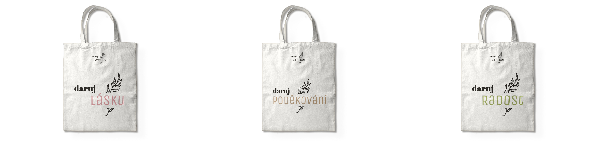

# Daruj květiny
## Give Flovers

Redesign of Prague-based flower shops called "Give Flowers". The claims come from the name and emphasize the symbolism behind giving flowers for example "give love" "give joy" and "give thanks". It's inspired by the romanticized era of The First Republic. The design is vintage yet modern and fresh with a pastel color palette. And I also thought about ecological packaging.

